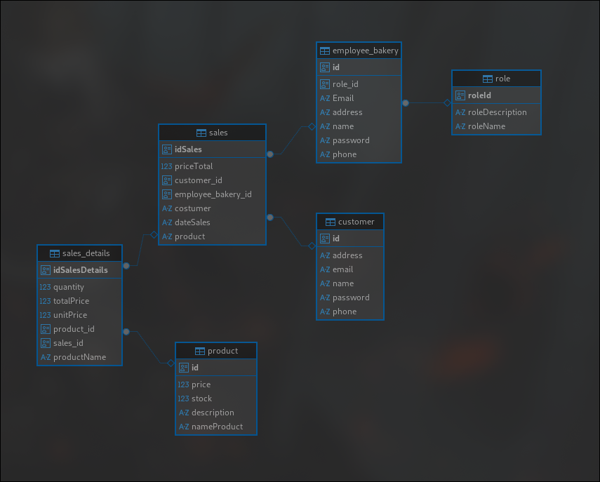
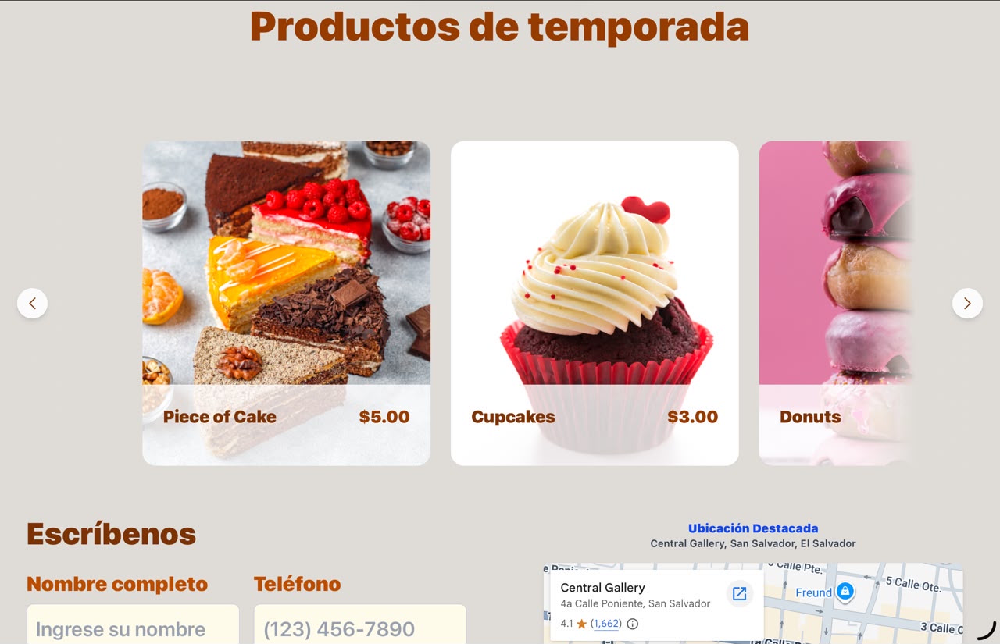
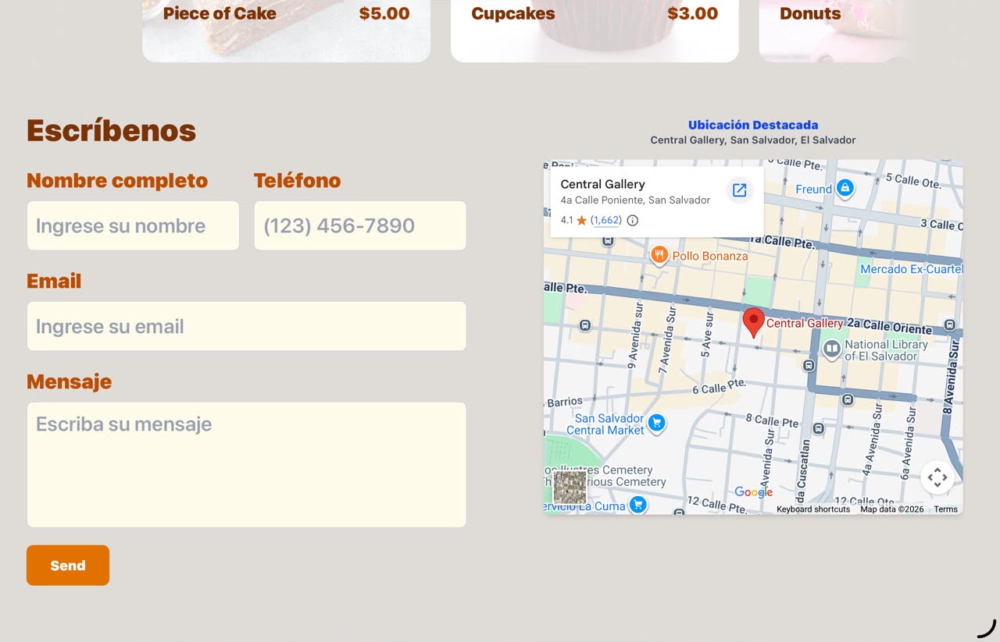
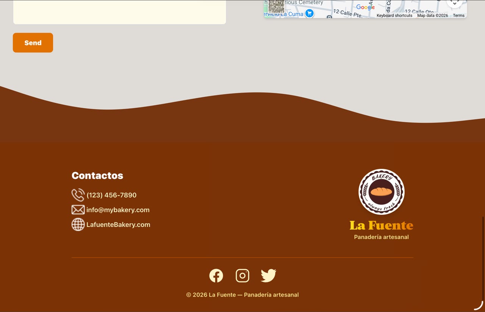
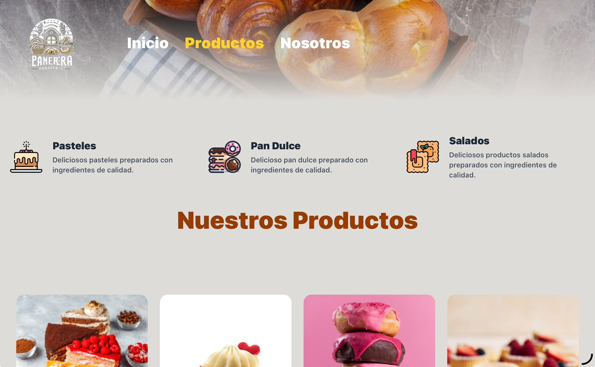
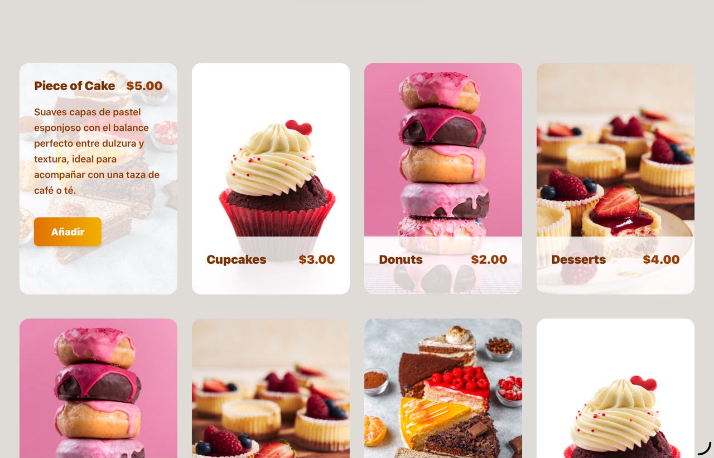
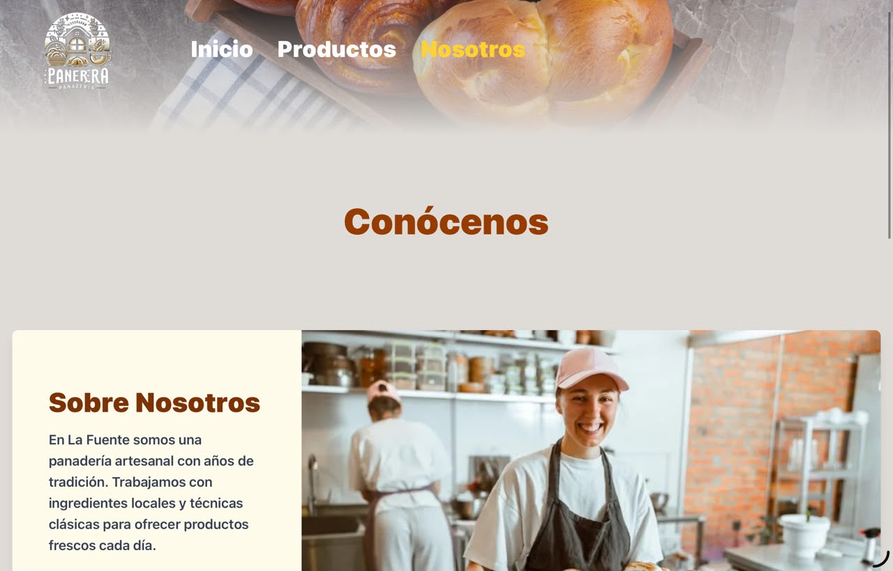

# 🥖 Panadería La Fuente

Bienvenido al repositorio oficial del sistema de gestión y visualización para la **Panadería La fuente**. Este proyecto tiene como objetivo ofrecer una experiencia moderna y eficiente para la administración de productos, ventas y clientes, así como una tienda en línea para los usuarios.

---

## 🧩 Tecnologías utilizadas

### Frontend:
- ⚛️ [React](https://reactjs.org/)
- ⚡ [Vite](https://vitejs.dev/)
- 🎨 [TailwindCSS](https://tailwindcss.com/)

### 🛠️ Backend

- ☕ [Spring Boot](https://spring.io/projects/spring-boot)
- ☕ [Spring Data JPA](https://spring.io/projects/spring-data-jpa)
- 🐘 [PostgreSQL](https://www.postgresql.org/)
- 🛠️ [Gradle](https://gradle.org/)
- 🐳 [Docker](https://www.docker.com/)
---

## 🏗️ Estructura del proyecto

```plaintext
📁 frontend/
  ├─ src/
  │  ├─ components/
  │  ├─ pages/
  │  ├─ assets/
  │  └─ App.jsx
📁 backend/
  └─ (Spring Boot API en desarrollo)
```
## 🗃️ Base de datos
La base de datos será creada en PostgreSQL. El backend (Spring Boot) manejará las conexiones y operaciones CRUD sobre los datos relacionados con productos, usuarios y pedidos.



## 🚀 Cómo ejecutar el proyecto

### 1. Clonar el repositorio

```bash
git clone https://github.com/A-gabrieRodriguez/Panaderia_web
cd tu-repo
```
### 2. Instalacion del fronted
```bash
cd frontend
pnpm install
pnpm dev --host  
```

# Diseño

* Video
https://github.com/user-attachments/assets/265a9f9f-412c-4b46-a508-6a1475457ecf

* Imagenes

| | | | |
| :---: | :---: | :---: | :---: |
|  |  |  |  |
|  |  |  | |


### 3. Configura y corre el backend
Asegúrate de tener PostgreSQL instalado y en funcionamiento.
 
 * Crea una base de datos en postgres:

```sql
 CREATE DATABASE panaderia_db;
```
*Configura el archivo application.properties en Spring Boot con las credenciales adecuadas:
```properties
spring.datasource.url=jdbc:postgresql://localhost:5432/panaderia_db
spring.datasource.username=tu_usuario
spring.datasource.password=tu_contraseña
spring.jpa.hibernate.ddl-auto=update
```
* Luego corre el backend:
```bash
cd backend
./mvnw spring-boot:run
```
### ✅ Lista por hacer (To-Do)

# ✅ Lista por hacer - Proyecto Seguridad Ciudad

---

## 🔧 Backend (Spring Boot)

- [x] Crear proyecto con Spring Initializr.
- [x] Agregar dependencias: Spring Web, Spring Data JPA, PostgreSQL Driver, Spring Security.
- [x] Configurar `application.properties` para conexión a PostgreSQL.
- [x] Crear modelos: `User`, `Visitante`, `Permiso`, etc.
- [x] Crear repositorios con Spring Data JPA.
- [x] Crear servicios para lógica de negocio.
- [x] Crear controladores REST (`UserController`, `VisitanteController`, etc.).
- [ ] Implementar autenticación JWT.
- [ ] Validaciones de entrada y manejo de errores.
- [ ] Crear endpoint para generar QR.
- [ ] Crear endpoint para verificar QR.
- [ ] Pruebas con Postman o Thunder Client.
- [ ] Agregar Swagger para documentación.
- [ ] Contenerizar la app con Docker (Spring Boot + PostgreSQL).
- [ ] Implementar roles (Admin, Residente, Visitante).
- [ ] Seguridad por endpoints.

---

## 🎨 Frontend (React + Vite + Tailwind)

- [x] Crear proyecto base con Vite.
- [x] Configurar Tailwind CSS.
- [ ] Definir estructura de carpetas (`components`, `pages`, `services`, etc.).
- [ ] Crear layout general (navbar, footer).
- [ ] Implementar sistema de rutas con React Router.
- [ ] Crear formulario de inicio de sesión.
- [ ] Implementar autenticación con API del backend.
- [ ] Crear páginas principales (Home, Perfil, Registro, etc.).
- [ ] Diseñar componente para generación de permisos.
- [ ] Conectar lógica del QR con backend.
- [ ] Validar formularios y manejar errores.
- [ ] Agregar estado global (opcional: Zustand, Redux, Context API).
- [ ] Probar funcionamiento completo con backend.
- [ ] Optimizar UI para dispositivos móviles.
- [ ] Agregar animaciones y mejoras visuales.


## 👨‍💻 Autor
Angel Gabriel Merlos Rodriguez – Desarrollador Junior

Gmail: [[argabrielrodriguez15@gmail.com](https://github.com/A-gabrieRodriguez)]

LinkedIn: [[Gabriel Rodriguez](https://www.linkedin.com/public-profile/settings)]
